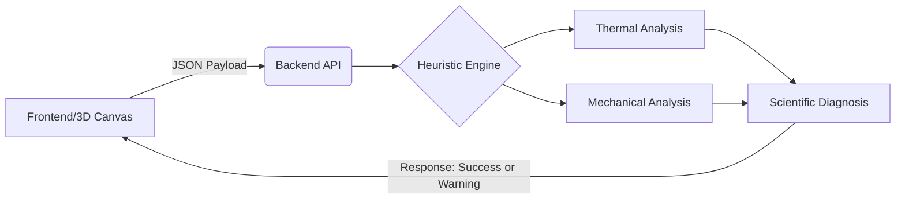

🇺🇸 [English Version](README.en.md) | 🇦🇴 🇧🇷 [Versão em Português](README.md)

<div align="center">
  <a href="https://github.com/westjoao12/sensiomat-ap3">
    
  </a>
  
  <h1>SensioMat</h1>
  <p><strong>IoT Architecture Engine and Materials Physics Heuristic Analysis</strong></p>

  <!-- Generic badges for professional appearance -->
  
  
  
</div>

<br/>

> **SensioMat** is a web platform that acts as the brain behind the architecture of IoT devices and wearables. Instead of relying on expensive and time-consuming physical prototyping, SensioMat uses a heuristic engine to simulate the thermodynamic, mechanical, and electrical viability of material stacks in milliseconds.

---

## 🧬 Origin and Motivation

SensioMat was born at the critical intersection of academic research and high-performance software engineering. The project was conceived to solve the materials incompatibility bottleneck in the development of devices for **IoT, Wearables, and Big Data in Health**. 

Theoretical foundations and the vision for innovation in information and digital health were nurtured through activities in the **PET-Saúde** program, while the platform's architectural robustness, focused on scalable and rigorous processing, is the direct result of advanced training in systems architecture consolidated in the **Residência em TIC-20 (Capacita Brasil/C-jovem)** and **ONE Tech Foundation G9 (Back-End)** programs. The result is a product that combines scientific rigor with software engineering excellence.

---

## 🚀 Key Features

* **Visual Builder (Drag-and-Drop):** Intuitive interface for stacking layers (Substrate, Circuit, Encapsulation).
* **Real-Time 3D Rendering:** Spatial visualization of the material stack using `Three.js` and `React Three Fiber`.
* **Physico-Mathematical Heuristic Engine:** Deterministic evaluation of parameters such as thermal conduction (Fourier's Law), mechanical stress, and electrical viability based on the operating environment.
* **Pitch & Diagnosis Mode:** Instant generation of viability reports and physical architecture integrity alerts (e.g., Delamination Risk, Thermomechanical Stress).
* **Internationalization (i18n):** Full support for `en-US` and `pt-AO`.

---

## 📚 Official Documentation (Deep Dive)

The detailed documentation of this monorepo has been segmented by target audience (investors, developers, evaluators) and can be found in the `/docs` folder. 

**Reading is recommended in the following order:**

1. 📖 [Overview and Market Context](./docs/en-US/overview.md) - *For Investors and Professors*
2. 🧠 [Heuristic Engine and Mathematical Model](./docs/en-US/heuristic-engine.md) - *For Evaluators and Scientists*
3. 🏗️ [Monorepo Architecture](./docs/en-US/architecture.md) - *For Frontend/Backend Developers*
4. 🔌 [API and Integration](./docs/en-US/api-integration.md) - *For Integration Engineers*
5. 🗺️ [Roadmap and Deployment (CI/CD)](./docs/en-US/roadmap-and-deploy.md) - *For DevOps and Contributors*

---

## ⚙️ Technology Stack

SensioMat adopts a monorepo topology, separating responsibilities while sharing the same CI/CD lifecycle.

| Layer | Main Technologies | Purpose |
| :--- | :--- | :--- |
| **Frontend** | React (Vite), Three.js (R3F), Zustand, Tailwind | Responsive SPA, 3D rendering, state machine. |
| **Backend** | Node.js, Express.js | REST API, Inference engine, and heuristic calculation. |
| **Integration**| REST API, JSON | Payload exchange in near real-time ($O(1)$). |
| **Deploy** | Vercel, GitHub Actions | Continuous integration and delivery (CI/CD). |

### Logical Processing View



---

## 🛠️ How to Run Locally

Follow the steps below to clone and start the local development environment (Current MVP). It requires **Node.js (v24+)** to be installed.

```bash
# 1. Clone the repository
git clone https://github.com/westjoao12/sensiomat-ap3.git
cd sensiomat-ap3

# 2. Start the Backend (Scientific Service and API)
cd backend
npm install
cp .env.example .env
npm run dev
# The backend will start on port 3001 (or as configured in .env)

# 3. In a new terminal, start the Frontend (Web Interface)
cd ../frontend
npm install
cp .env.example .env
npm run dev
# The frontend will be available at http://localhost:5173
```

---

## 🤝 Contribution and License

This is a project born out of research and engineering, open to academic scrutiny and collaboration. To contribute, please check our [Roadmap](./docs/en-US/roadmap-and-deploy.md) and review the open pull requests.

Distributed under the **MIT License**. See the `LICENSE` file for more details.