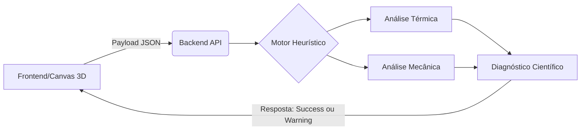

<a href="README.en.md"> English Version</a> | 
<a href="README.md">  Versão em Português</a>

<div align="center">
  <a href="https://github.com/westjoao12/sensiomat-ap3">
    
  </a>
  
  <h1>SensioMat</h1>
  <p><strong>Motor de Arquitetura IoT e Análise Heurística de Física de Materiais</strong></p>

  <!-- Badges genéricas para aspeto profissional -->
  
  
  
</div>

<br/>

> **SensioMat** é uma plataforma web que atua como o cérebro por trás da arquitetura de dispositivos IoT e *wearables*. Em vez de depender de prototipagem física dispendiosa e demorada, o SensioMat utiliza um motor heurístico para simular a viabilidade termodinâmica, mecânica e elétrica de pilhas (*stacks*) de materiais em milissegundos.

---

## 🧬 A Origem e Motivação

O SensioMat nasce na intersecção crítica entre a pesquisa académica e a engenharia de software de alta performance. O projeto foi idealizado para resolver o gargalo da incompatibilidade de materiais no desenvolvimento de dispositivos para **IoT, Wearables e Big Data em Saúde**. 

As fundações teóricas e a visão de inovação em informação e saúde digital foram nutridas através das atividades no programa **PET-Saúde**, enquanto a robustez arquitetural da plataforma, focada num processamento escalável e rigoroso, é o resultado direto de formações avançadas em arquiteturas de sistemas, consolidadas nos programas **Residência em TIC-20 (Capacita Brasil/C-jovem)** e **ONE Tech Foundation G9 (Back-End)**. O resultado é um produto que alia o rigor científico a uma arquitetura de software de excelência.

---

## 🚀 Principais Funcionalidades

* **Construtor Visual (*Drag-and-Drop*):** Interface intuitiva para empilhar camadas (Substrato, Circuito, Encapsulamento).
* **Renderização 3D em Tempo Real:** Visualização espacial do *stack* de materiais utilizando `Three.js` e `React Three Fiber`.
* **Motor Heurístico Físico-Matemático:** Avaliação determinística de parâmetros como condução térmica (Lei de Fourier), stress mecânico e viabilidade elétrica com base no ambiente de operação.
* **Modo Pitch & Diagnóstico:** Geração instantânea de relatórios de viabilidade e alertas de integridade da arquitetura física (ex: Risco de Delaminação, Tensão Termomecânica).
* **Internacionalização (i18n):** Suporte completo para `pt-AO` e `en-US`.

---

## 📚 Documentação Oficial (Deep Dive)

A documentação detalhada deste monorepo foi segmentada por público-alvo (investidores, desenvolvedores, avaliadores) e encontra-se na pasta `/docs`. 

**Recomenda-se a leitura na seguinte ordem:**

1. 📖 [Visão Geral e Contexto de Mercado](./docs/pt-AO/visao-geral.md) - *Para Investidores e Professores*
2. 🧠 [Motor Heurístico e Modelo Matemático](./docs/pt-AO/motor-heuristico.md) - *Para Avaliadores e Cientistas*
3. 🏗️ [Arquitetura do Monorepo](./docs/pt-AO/arquitetura.md) - *Para Desenvolvedores Frontend/Backend*
4. 🔌 [API e Integração](./docs/pt-AO/api-integracao.md) - *Para Engenheiros de Integração*
5. 🗺️ [Roadmap e Implantação (CI/CD)](./docs/pt-AO/roadmap-e-deploy.md) - *Para DevOps e Contribuidores*

---

## ⚙️ Stack Tecnológica

O SensioMat adota uma topologia de monorepo, separando responsabilidades enquanto partilha o mesmo ciclo de vida de CI/CD.

| Camada | Tecnologias Principais | Propósito |
| :--- | :--- | :--- |
| **Frontend** | React (Vite), Three.js (R3F), Zustand, Tailwind | SPA responsiva, renderização 3D, state machine. |
| **Backend** | Node.js, Express.js | API REST, Motor de inferência e cálculo heurístico. |
| **Integração**| REST API, JSON | Troca de *payloads* em tempo quase real ($O(1)$). |
| **Deploy** | Vercel, GitHub Actions | Integração e entrega contínua (CI/CD). |

### Visão Lógica de Processamento



---

## 🛠️ Como Executar Localmente

Siga os passos abaixo para clonar e iniciar o ambiente de desenvolvimento local (MVP Atual). É necessário ter o **Node.js (v24+)** instalado.

```bash
# 1. Clone o repositório
git clone https://github.com/westjoao12/sensiomat-ap3.git
cd sensiomat-ap3

# 2. Inicie o Backend (Serviço Científico e API)
cd backend
npm install
cp .env.example .env
npm run dev
# O backend iniciará na porta 3001 (ou configurada no .env)

# 3. Em um novo terminal, inicie o Frontend (Interface Web)
cd ../frontend
npm install
cp .env.example .env
npm run dev
# O frontend ficará disponível em http://localhost:5173
```

---

## 🤝 Contribuição e Licença

Este é um projeto nascido no seio da investigação e engenharia, aberto ao escrutínio académico e colaboração. Para contribuir, consulte o nosso [Roadmap](./docs/pt-AO/roadmap-e-deploy.md) e verifique os *pull requests* abertos.

Distribuído sob a **Licença MIT**. Veja o ficheiro `LICENSE` para mais detalhes.