# Arquitetura do Sistema e Topologia do Monorepo

Este documento descreve a arquitetura de software do SensioMat, detalhando a estrutura do código-fonte, as tecnologias adotadas e o fluxo de dados entre as camadas da aplicação. A plataforma foi desenhada com foco em modularidade, baixa latência computacional e escalabilidade, preparando o terreno para futuras integrações complexas.

---

## 1. Topologia do Monorepo (Implementado Atualmente)

O projeto adota uma abordagem de **Monorepo**, unificando o código do cliente (Frontend) e do servidor (Backend) num único repositório. Esta estratégia simplifica a orquestração de CI/CD (Continuous Integration / Continuous Deployment) e garante consistência de versão entre a interface e as regras de negócio.

```text
sensiomat-ap3/
│
├── backend/                  # [Backend] Motor API e Heurística (Node.js)
│   ├── src/
│   │   ├── controllers/      # Controladores de rotas
│   │   ├── data/             # Base de dados estática (Catálogo de Materiais)
│   │   ├── repositories/     # Responsável por centralizar o acesso e a manipulação dos dados
│   │   ├── routes/           # Responsável por definir os endpoints da API
│   │   ├── services/         # Lógica de negócio e cálculos físicos
│   │   └── server.js         # Ponto de entrada do servidor
│   ├── .env.example
│   └── package.json
│
├── frontend/                 # [Frontend] Interface de Utilizador (React)
│   ├── src/
│   │   ├── components/       # Componentes visuais (UI, 3D Canvas)
│   │   ├── locales/          # Dicionários de internacionalização
│   │   ├── services/         # Consumo da Api ou conexão com o backend
│   │   ├── store/            # Gestão de estado global (Zustand)
│   │   ├── utils/            # Contendo o arquivo simulationEngine.js para validação do Lógica de negócio e cálculos
│   │   ├── App.jsx
│   │   └── i18n.js           # internacionalização
│   ├── public/
│   ├── .env.example
│   └── package.json
│
├── docs/                     # Documentação Oficial do Projeto
│   ├── visao-geral.md
│   ├── motor-heuristico.md
│   ├── arquitetura.md
│   ├── api-integracao.md
│   └── roadmap-e-deploy.md
│
├── .github/                  # [DevOps] Pipelines de automação
│   └── workflows/
│       ├── deploy.yml
│       ├── tests.yml
│       └── lint.yml
│
├── vercel.json               # Configurações de Deploy (Vercel)
├── README.md                 # Espelho do repositório
└── LICENSE                   # Licença Open-Source
```

---

## 2. Ecossistema Tecnológico

A *stack* tecnológica foi selecionada para garantir renderização 3D fluida no lado do cliente e processamento não-bloqueante de regras heurísticas no servidor.

*   **[Frontend]**
    *   **Core:** React.js (Vite) para construção da SPA (*Single Page Application*).
    *   **Renderização 3D:** Three.js acoplado com React Three Fiber (R3F) para representação espacial e interativa da pilha de materiais.
    *   **Gestão de Estado:** Zustand (desacoplamento de lógica complexa dos componentes de UI).
    *   **Estilização:** Tailwind CSS (Dark/Light mode dinâmico).
    *   **Internacionalização:** `react-i18next` para transição instantânea de idiomas (`pt-AO`, `en-US`).

*   **[Backend]**
    *   **Core:** Node.js com Express.js para a construção de uma API RESTful leve e escalável.
    *   **Processamento:** Arquitetura orientada a serviços (Service Pattern) para isolar o motor de cálculo heurístico das rotas HTTP.

---

## 3. Fluxo de Comunicação e Ciclo de Vida dos Dados

A comunicação entre as camadas ocorre através de chamadas HTTP/REST. O diagrama abaixo ilustra o ciclo de vida completo de uma requisição de simulação de materiais, evidenciando o tratamento e a resposta do sistema.

```mermaid
sequenceDiagram
    participant U as Utilizador
    participant UI as Interface (React)
    participant State as Store (Zustand)
    participant API as Backend (Express)
    participant Engine as Motor Heurístico

    U->>UI: Arrasta materiais para os Slots
    UI->>State: Atualiza Pilha (Substrato, Circuito, Encap)
    U->>UI: Clica em "Simular"
    UI->>State: runSimulation()
    State->>API: POST /api/simulate (Payload JSON)
    
    rect rgb(30, 40, 50)
    Note over API,Engine: Processamento no Servidor
    API->>Engine: Injeta Payload (Materiais + Ambiente)
    Engine->>Engine: Resolve Restrições Térmicas e Mecânicas
    Engine-->>API: Retorna Objeto de Diagnóstico
    end
    
    API-->>State: 200 OK (Resultados da Simulação)
    State->>UI: Atualiza Painel de Relatório
    UI-->>U: Exibe Alertas e Renderização 3D Final
```



---

## 4. Padrões de Projeto (Design Patterns)

*   **State Machine (Frontend):** O Zustand atua como uma máquina de estado centralizada, garantindo que o `Canvas3D` e a `Sidebar` reajam simultaneamente às mesmas fontes de dados sem *prop-drilling*.
*   **Controller-Service (Backend):** O desacoplamento estrito entre a camada de rede (Controllers que lidam com Requisições/Respostas) e a lógica de domínio (Services que executam os cálculos físicos), facilitando a manutenção e a criação de testes unitários.

---

## 5. Proposta Conceitual (Próximas Versões)

À medida que o SensioMat escalar para cenários reais em saúde digital e biossensores corporais, a arquitetura evoluirá para acomodar novos requisitos:

1.  **Pipeline de Big Data e Analytics:** 
    *   **Conceito:** Implementação de um barramento de eventos (ex: Apache Kafka) para capturar anonimamente os resultados das simulações.
    *   **Objetivo:** Criar um *Data Lake* de arquiteturas IoT, permitindo treinar modelos de *Machine Learning* para sugerir combinações de materiais automaticamente, otimizando sensores para implantes médicos.
2.  **Persistência Híbrida (PostgreSQL + Redis):**
    *   **Conceito:** Substituição do catálogo JSON estático por uma base de dados relacional (PostgreSQL) para gestão de utilizadores e histórico de projetos, e Redis para cache de simulações complexas de requisições repetidas.
3.  **WebSockets para Colaboração em Tempo Real:**
    *   **Conceito:** Migrar rotas críticas da API REST para WebSockets (Socket.io), permitindo que equipas de engenheiros editem a mesma pilha de materiais simultaneamente em sessões colaborativas.