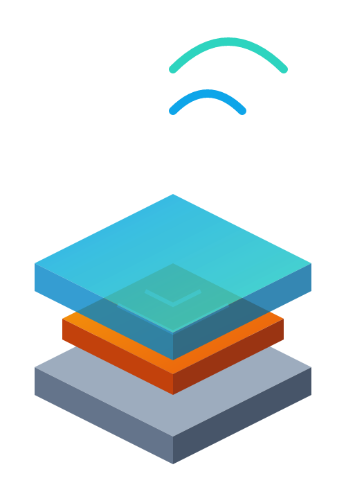

<div align="center">
  <table>
    <tr>
      <td align="center" width="150">
        
      </td>
      <td>
        <h1>SensioMat: IoT Architecture Engine and Materials Physics Heuristic Analysis</h1>
        <p><strong>System Architecture and Monorepo Topology</strong></p>
      </td>
    </tr>
  </table>
</div>

This document describes the software architecture of SensioMat, detailing the source code structure, adopted technologies, and data flow between application layers. The platform was designed with a focus on modularity, low computational latency, and scalability, paving the way for complex future integrations.

---

## 1. Monorepo Topology (Currently Implemented)

The project adopts a **Monorepo** approach, unifying client (Frontend) and server (Backend) code in a single repository. This strategy simplifies CI/CD (Continuous Integration / Continuous Deployment) orchestration and ensures version consistency between the interface and business rules.

```text
sensiomat-ap3/
│
├── backend/                  # [Backend] API and Heuristic Engine (Node.js)
│   ├── src/
│   │   ├── controllers/      # Route controllers
│   │   ├── data/             # Static database (Materials Catalog)
│   │   ├── repositories/     # Responsible for centralizing data access and manipulation
│   │   ├── routes/           # Responsible for defining API endpoints
│   │   ├── services/         # Business logic and physical calculations
│   │   └── server.js         # Server entry point
│   ├── .env.example
│   └── package.json
│
├── frontend/                 # [Frontend] User Interface (React)
│   ├── src/
│   │   ├── components/       # Visual components (UI, 3D Canvas)
│   │   ├── locales/          # Internationalization dictionaries
│   │   ├── services/         # API consumption or backend connection
│   │   ├── store/            # Global state management (Zustand)
│   │   ├── utils/            # Contains the simulationEngine.js file for business logic and calculation validation
│   │   ├── App.jsx
│   │   └── i18n.js           # Internationalization setup
│   ├── public/
│   ├── .env.example
│   └── package.json
│
├── docs/                     # Official Project Documentation
│   ├── en-US/
│   │   ├── overview.md
│   │   ├── heuristic-engine.md
│   │   ├── architecture.md
│   │   ├── api-integration.md
│   │   └── roadmap-and-deploy.md
│   └── pt-AO/
│       ├── visao-geral.md
│       ├── motor-heuristico.md
│       ├── arquitetura.md
│       ├── api-integracao.md
│       └── roadmap-e-deploy.md
│
├── .github/                  # [DevOps] Automation pipelines
│   └── workflows/
│       ├── deploy.yml
│       ├── tests.yml
│       └── lint.yml
│
├── vercel.json               # Deploy Configurations (Vercel)
├── README.md                 # Repository mirror
└── LICENSE                   # Open-Source License
```

---

## 2. Technological Ecosystem

The technology stack was selected to ensure fluid 3D rendering on the client side and non-blocking processing of heuristic rules on the server.

*   **[Frontend]**
    *   **Core:** React.js (Vite) for building the SPA (*Single Page Application*).
    *   **3D Rendering:** Three.js coupled with React Three Fiber (R3F) for interactive and spatial representation of the materials stack.
    *   **State Management:** Zustand (decoupling complex logic from UI components).
    *   **Styling:** Tailwind CSS (Dynamic Dark/Light mode).
    *   **Internationalization:** `react-i18next` for instant language switching (`pt-AO`, `en-US`).

*   **[Backend]**
    *   **Core:** Node.js with Express.js for building a lightweight and scalable RESTful API.
    *   **Processing:** Service-oriented architecture (Service Pattern) to isolate the heuristic calculation engine from HTTP routes.

---

## 3. Communication Flow and Data Lifecycle

Communication between layers occurs through HTTP/REST calls. The diagram below illustrates the complete lifecycle of a materials simulation request, highlighting the system's processing and response.

```mermaid
sequenceDiagram
    participant U as User
    participant UI as Interface (React)
    participant State as Store (Zustand)
    participant API as Backend (Express)
    participant Engine as Heuristic Engine

    U->>UI: Drags materials to Slots
    UI->>State: Updates Stack (Substrate, Circuit, Encap)
    U->>UI: Clicks "Simulate"
    UI->>State: runSimulation()
    State->>API: POST /api/simulate (JSON Payload)
    
    rect rgb(30, 40, 50)
    Note over API,Engine: Server Processing
    API->>Engine: Injects Payload (Materials + Environment)
    Engine->>Engine: Resolves Thermal and Mechanical Constraints
    Engine-->>API: Returns Diagnosis Object
    end
    
    API-->>State: 200 OK (Simulation Results)
    State->>UI: Updates Report Panel
    UI-->>U: Displays Alerts and Final 3D Render
```



---

## 4. Design Patterns

*   **State Machine (Frontend):** Zustand acts as a centralized state machine, ensuring that the `Canvas3D` and the `Sidebar` react simultaneously to the same data sources without *prop-drilling*.
*   **Controller-Service (Backend):** Strict decoupling between the network layer (Controllers handling Requests/Responses) and domain logic (Services executing physical calculations), facilitating maintenance and unit test creation.

---

## 5. Conceptual Proposal (Future Versions)

As SensioMat scales for real-world scenarios in digital health and body biosensors, the architecture will evolve to accommodate new requirements:

1.  **Big Data and Analytics Pipeline:**
    *   **Concept:** Implementation of an event bus (e.g., Apache Kafka) to anonymously capture simulation results.
    *   **Objective:** Create a Data Lake of IoT architectures, allowing the training of *Machine Learning* models to automatically suggest material combinations, optimizing sensors for medical implants.
2.  **Hybrid Persistence (PostgreSQL + Redis):**
    *   **Concept:** Replacing the static JSON catalog with a relational database (PostgreSQL) for user management and project history, and Redis for caching complex simulations of repeated requests.
3.  **WebSockets for Real-Time Collaboration:**
    *   **Concept:** Migrate critical REST API routes to WebSockets (Socket.io), enabling teams of engineers to edit the same materials stack simultaneously in collaborative sessions.