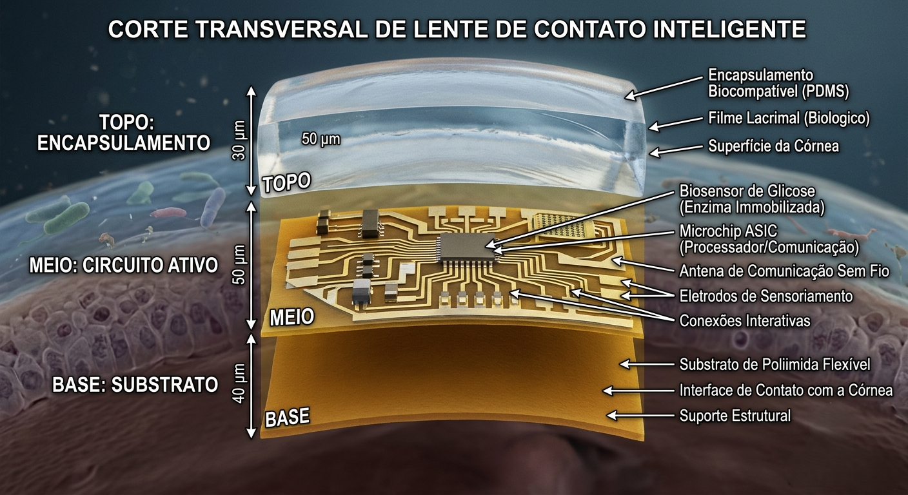
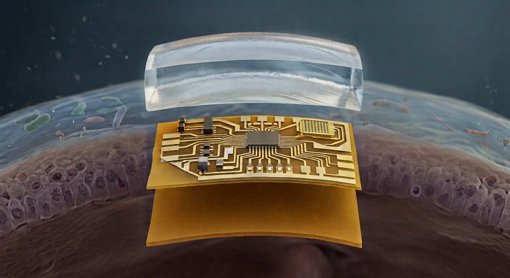

  <table>
    <tr>
      <td align="center" width="150">
        
      </td>
      <td>
        <h1>SensioMat for Beginners</h1>
        
<strong>What it is, how it works, and why it matters (Explained simply)</strong>

      </td>
    </tr>
  </table>

---

## 💡 The Real-World Problem

Imagine you want to create a new wearable device, like an ultra-thin smartwatch or a **smart contact lens** capable of measuring glucose levels through tears. 

For this device to work, it needs microchips and microscopic wires. The problem is that, in the real world, mixing physical materials is complicated. If you put a metal that gets very hot next to a sensitive plastic, the plastic melts. If you use a toxic material in a medical implant, the human body rejects it. 

Testing these combinations in a real laboratory costs a lot of time and money. This is exactly where **SensioMat** comes in.

SensioMat is a virtual laboratory. It allows scientists and engineers to "stack" different materials on a computer and discover, in fractions of a second, whether this device will work in real life or if it will fail (melt, break, or short-circuit).

---

## 🥪 The Logic of Layers (Like a Tech "Sandwich")

To understand SensioMat, just look at the image below. Every biosensor or IoT (Internet of Things) device validated on our platform is divided into three fundamental layers.

  
  
<em>Practical example: A smart contact lens divided into its three main layers.</em>

For a device to be approved by the system, it must respect the physics of each of these three stages:

### 1. The Base: The Substrate
It is the **"floor"** of the device.
* **What it does:** Serves as the foundation where everything will be built. 
* **The rule:** It must be a thermal and electrical insulator (like special plastics or ceramics). If you use a metal like Copper at the base, energy leaks and creates a short circuit. Furthermore, if the device is flexible (like a lens for the eye), the base cannot be rigid, otherwise it will break when bent.

### 2. The Middle: The Active Circuit
It is the **"highway"** of information.
* **What it does:** This is where data and electricity flow (microchips, antennas, sensors).
* **The rule:** It must be a material with high electrical conductivity (metals like Gold, Silver, Copper, or advanced materials like Graphene). If we place an insulator in this layer, the system reports a failure because the sensor simply "won't turn on."

### 3. The Top: The Encapsulation
It is the **"protective shield"**.
* **What it does:** Protects the sensitive circuit from the external environment (water, heat, dust) and, at the same time, protects the user from the circuit itself.
* **The rule:** It must withstand the harshness of the environment. If it is meant to be implanted in the human body (like the lens in the image), **it must be biocompatible** (e.g., a special silicone like PDMS). Copper, for instance, cannot be in direct contact with the body, as it oxidizes and becomes toxic.

---

## 🚀 The Result

  

When an engineer chooses the materials for these three layers in the SensioMat interface and clicks "Simulate," the platform performs invisible, instantaneous mathematical calculations. 

It warns immediately if the "floor" will hold up, if the "highway" conducts energy well, and if the "shield" will not melt. This way, we ensure that the technology of the future reaches society safely, quickly, and efficiently.