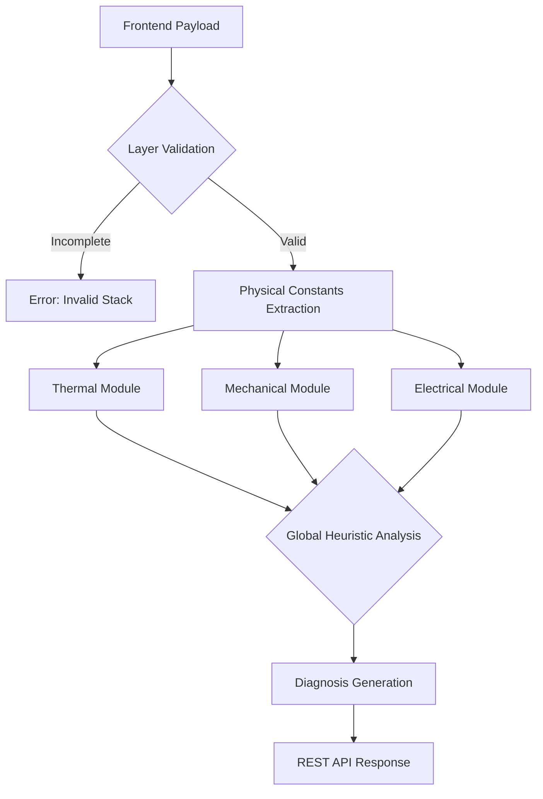

  <table>
    <tr>
      <td align="center" width="150">
        
      </td>
      <td>
        <h1>SensioMat: IoT Architecture Engine and Materials Physics Heuristic Analysis</h1>
        
<strong>Heuristic Engine: Physico-Mathematical Foundation</strong>

      </td>
    </tr>
  </table>

This document details the scientific core of SensioMat. The platform utilizes a deterministic inference engine located in the `Backend`, responsible for evaluating the physical viability of an IoT architecture in fractions of a second, replacing slow numerical methods (such as *Finite Element Method* - FEM) with rigorous heuristic rules focused on material stacks.

## 1. Processing Architecture (Backend)

The computational engine receives the interface configuration and processes the data through a cascade of thermo-mechanical and electrical validations. The execution flow ensures that critical structural failures (e.g., melting of the encapsulation layer) are identified before performance calculation.

## 2. Mathematical Modeling (Currently Implemented)

The current core of SensioMat evaluates the interaction between the three fundamental layers of a biosensor (Substrate, Circuit, and Encapsulation) based on the properties described in the materials database.

### 2.1. Thermal Dynamics (Conduction and Dissipation)
The analysis of heat dissipation through the stack assumes a one-dimensional steady-state model, based on Fourier's Law. The total thermal resistance of the structure ($R_{th}$) is the sum of the individual resistances of each layer:

$$R_{th} = \sum_{i=1}^{3} \frac{L_i}{k_i \cdot A}$$

Where:
*   $L_i$ represents the layer thickness.
*   $k_i$ is the specific thermal conductivity of the material.
*   $A$ is the cross-sectional contact area.

The system calculates the operational temperature limit by verifying if the melting point of the encapsulation polymer ($T_{melt}$) is higher than the heat dissipated by the semiconductor circuit ($Q_{joule}$). 

### 2.2. Thermomechanical Stress
In environments with high temperature variation (e.g., `Precision Agriculture / Soil`), the incompatibility of the coefficients of thermal expansion ($\alpha$) between the rigid substrate and the metallic circuit can cause fractures. The induced stress ($\sigma$) at the interface is estimated by:

$$\sigma = \frac{E}{(1 - \nu)} \cdot \Delta\alpha \cdot \Delta T$$

Where:
*   $E$ is the material's Young's Modulus.
*   $\nu$ is the Poisson's Ratio.
*   $\Delta\alpha$ is the difference in thermal expansion between adjacent layers.
*   $\Delta T$ is the extreme thermal gradient of the environment.

If $\sigma$ exceeds the elastic limit of any layer, the platform issues a "Delamination Risk" alert.

### 2.3. Electrical Heuristics and Shielding
The system penalizes architectures where the encapsulation has high electrical conductivity, preventing unintentional short circuits in the biosensor. Viability is given by a simple boolean function in the MVP:

$$V_{el} = \begin{cases} 1, & \text{if } \sigma_{encap} < 10^{-8} \, \text{S/m} \\ 0, & \text{otherwise} \end{cases}$$

## 3. Integration with Environmental Use Cases

Each simulation environment acts as a *State Modifier* in the equations above:

*   **Body Implant (`env_body_implant`):** Imposes severe biocompatibility restrictions. The absolute maximum limit of the stack's external temperature is fixed at **39°C** (avoiding cellular denaturation).
*   **Agricultural Soil (`env_agri_soil`):** Applies accelerated degradation factors due to moisture and pH, evaluating the cathodic oxidation potential of the circuit metals.
*   **Industrial Zone (`env_industrial_hot`):** $\Delta T$ is maximized, forcing the engine to focus on the $R_{th}$ index and resistance to thermal melting.

## 4. Model Evolution (Conceptual Proposal)

Although the current heuristic resolves primary architectural validations in $O(1)$ (constant time), the next iterations of SensioMat anticipate:

1.  **Quantum Transition (External API):** Integration with the *Materials Project API* to replace static constants in JSON with dynamic *Density Functional Theory* (DFT) vectors.
2.  **Fluid Mechanics (Microfluidics):** Inclusion of variables for sweat-based epidermal sensors, modeling capillarity ($\Delta P$) through Washburn's equation:

$$L(t) = \sqrt{\frac{\gamma \cdot r \cdot \cos(\theta)}{2 \eta} \cdot t}$$

Where $\gamma$ is the surface tension, $r$ is the microchannel radius, and $\eta$ is the analyzed fluid's viscosity.