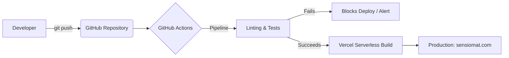

<div align="center">
  <table>
    <tr>
      <td align="center" width="150">
        
      </td>
      <td>
        <h1>SensioMat: IoT Architecture Engine and Materials Physics Heuristic Analysis</h1>
        <p><strong>Deployment and Development Roadmap</strong></p>
      </td>
    </tr>
  </table>
</div>

This document provides the guidelines for local execution, the continuous deployment (CI/CD) strategy, and the technical evolution roadmap of SensioMat. The goal is to guide developers, DevOps teams, and stakeholders on the current state of the project and its long-term vision at the intersection of materials science, digital health, and precision agriculture.

---

## 1. Deployment Strategy and CI/CD (Currently Implemented)

The repository uses GitHub Actions for continuous integration and the **Vercel** platform for continuous delivery of the monorepo, ensuring that the application is always optimized and available with minimal latency.

### 1.1. Deployment Architecture

The deployment orchestration automates code quality checking before reflecting changes in the production environment.



### 1.2. Local Execution (Development)

To clone and run the current version (MVP) in an isolated development environment, follow the instructions below:

**Prerequisites:** Node.js (v24+) and NPM/Yarn.

```bash
# 1. Clone the repository
git clone [https://github.com/westjoao12/sensiomat-ap3.git](https://github.com/westjoao12/sensiomat-ap3.git)
cd sensiomat-ap3

# 2. Install dependencies (Monorepo)
# The environment may require separate installation in the frontend and backend in the current MVP
cd frontend && npm install
cd ../backend && npm install

# 3. Configure Environment Variables
# Copy .env.example to .env in the respective folders
cp frontend/.env.example frontend/.env
cp backend/.env.example backend/.env

# 4. Start development servers
# Terminal 1 (Backend):
cd backend && npm run dev
# Terminal 2 (Frontend):
cd frontend && npm run dev
```

---

## 2. Roadmap: The Future of SensioMat

The development of SensioMat is planned in three main phases, designed to scale the system from a static validation tool to an intelligent and dynamic ecosystem.

### Phase 1: Heuristic Validation and Interface (🟢 Completed / Current MVP)
The focus of this stage was to prove the central concept: replacing expensive laboratory testing with software-based evaluations.
*   **[Frontend]** 3D rendering engine and interactive interface (*Drag-and-Drop*).
*   **[Backend]** Heuristic engine capable of processing thermomechanical and heat dissipation equations in constant time ($O(1)$).
*   **[System]** Native support for internationalization (i18n).

### Phase 2: Health Big Data Ecosystem (🟡 Planned for Future Versions)
With the consolidated architectural base, the objective shifts to processing large volumes of data to optimize material selection.
*   **[Database]** Implementation of persistence with PostgreSQL, allowing users to save and share architectures and results.
*   **[Data Service]** Construction of a **Big Data analytics** *pipeline*, capable of aggregating thousands of anonymized simulations.
*   **[Backend / AI]** Automated recommendation module. Based on predictive analysis (Big Data), SensioMat will actively suggest corrections (e.g., "In 85% of *wearables* simulated for the epidermis, replacing Alumina with PDMS reduced the risk of micro-lesions").

### Phase 3: Dynamic IoT and Real-Time Synchronization (🔴 Conceptual Proposal)
The long-term vision elevates SensioMat to a *Digital Twin* platform, communicating not only with theoretical *hardware* but with real devices in operation.
*   **[Scientific Service]** Quantum Integration: Direct consumption of academic databases (e.g., Materials Project) for simulation based on Density Functional Theory (DFT).
*   **[IoT Integration]** Creation of a bridge (via MQTT/WebSockets) where real physical prototypes of biosensors send telemetry back to the platform. SensioMat would compare, in real-time, the thermal/mechanical stress of the physical device in the field against the limits calculated in its heuristic engine.
*   **[Specialized Applications]** Creation of dedicated sub-modules:
    *   *SensioMat Health:* Extreme focus on flexible polymeric matrices and biocompatibility for the next generation of continuous monitoring *wearables*.
    *   *SensioMat Agri:* Focus on anodic corrosion and durability for subsoil sensors operating in agricultural IoT networks.