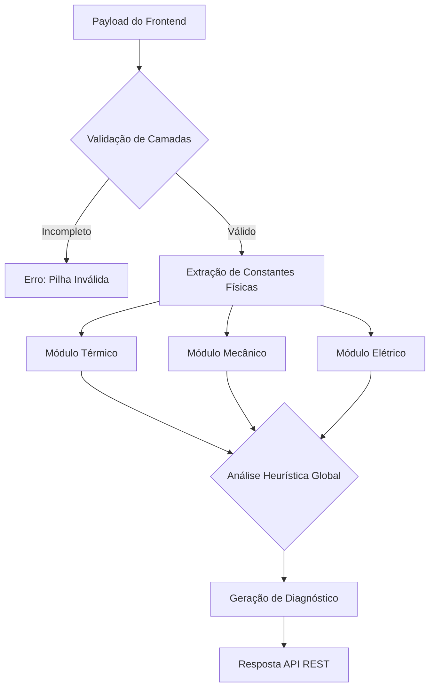

  <table>
    <tr>
      <td align="center" width="150">
        <!-- Substitua logo.png pelo nome real do seu arquivo -->
        
      </td>
      <td>
        <h1>SensioMat: Motor de Arquitetura IoT e Análise Heurística de Física de Materiais</h1>
        
<strong>Motor Heurístico: Fundamentação Físico-Matemática</strong>

      </td>
    </tr>
  </table>

 

Este documento detalha o núcleo científico do SensioMat. A plataforma utiliza um motor de inferência determinístico localizado no `Backend`, responsável por avaliar a viabilidade física de uma arquitetura IoT em frações de segundo, substituindo métodos numéricos lentos (como *Finite Element Method* - FEM) por regras heurísticas rigorosas focadas em pilhas (*stacks*) de materiais.

## 1. Arquitetura de Processamento (Backend)

O motor computacional recebe a configuração da interface e processa os dados através de uma cascata de validações termo-mecânicas e elétricas. O fluxo de execução garante que falhas estruturais críticas (ex: derretimento da camada de encapsulamento) sejam identificadas antes do cálculo de performance.

## 2. Modelagem Matemática (Implementado Atualmente)

O núcleo atual do SensioMat avalia a interação entre as três camadas fundamentais de um biossensor (Substrato, Circuito e Encapsulamento) baseando-se nas propriedades descritas na base de dados de materiais.

### 2.1. Dinâmica Térmica (Condução e Dissipação)
A análise da dissipação de calor através da pilha assume um modelo unidimensional em estado estacionário, baseado na Lei de Fourier. A resistência térmica total da estrutura ($R_{th}$) é a soma das resistências individuais de cada camada:

$$R_{th} = \sum_{i=1}^{3} \frac{L_i}{k_i \cdot A}$$

Onde:
*   $L_i$ representa a espessura da camada.
*   $k_i$ é a condutividade térmica específica do material.
*   $A$ é a área transversal de contato.

O sistema calcula o limite de temperatura operacional verificando se o ponto de fusão do polímero de encapsulamento ($T_{melt}$) é superior ao calor dissipado pelo circuito semicondutor ($Q_{joule}$). 

### 2.2. Tensão Termomecânica
Em ambientes de alta variação de temperatura (ex: `Agricultura de Precisão / Solo`), a incompatibilidade dos coeficientes de expansão térmica ($\alpha$) entre o substrato rígido e o circuito metálico pode causar fraturas. A tensão induzida ($\sigma$) na interface é estimada por:

$$\sigma = \frac{E}{(1 - \nu)} \cdot \Delta\alpha \cdot \Delta T$$

Onde:
*   $E$ é o Módulo de Young do material.
*   $\nu$ é o Coeficiente de Poisson.
*   $\Delta\alpha$ é a diferença de expansão térmica entre as camadas vizinhas.
*   $\Delta T$ é o gradiente térmico extremo do ambiente.

Se $\sigma$ ultrapassar o limite de elasticidade de qualquer camada, a plataforma emite um alerta de "Risco de Delaminação".

### 2.3. Heurística Elétrica e Blindagem
O sistema penaliza arquiteturas onde o encapsulamento possui alta condutividade elétrica, prevenindo curtos-circuitos não intencionais no biossensor. A viabilidade é dada por uma função booleana simples no MVP:

$$V_{el} = \begin{cases} 1, & \text{se } \sigma_{encap} < 10^{-8} \, \text{S/m} \\ 0, & \text{caso contrário} \end{cases}$$

## 3. Integração com Casos de Uso Ambientais

Cada ambiente de simulação atua como um modificador de estado (*State Modifier*) nas equações acima:

*   **Implante Corporal (`env_body_implant`):** Impõe restrições severas de biocompatibilidade. O limite máximo absoluto da temperatura externa da pilha é fixado em **39°C** (evitando desnaturação celular).
*   **Solo Agrícola (`env_agri_soil`):** Aplica fatores de degradação acelerada devido à umidade e pH, avaliando o potencial de oxidação catódica dos metais do circuito.
*   **Zona Industrial (`env_industrial_hot`):** $\Delta T$ é maximizado, forçando o motor a focar no índice $R_{th}$ e na resistência ao derretimento térmico.

## 4. Evolução do Modelo (Proposta Conceitual)

Embora a heurística atual resolva validações arquiteturais primárias em $O(1)$ (tempo constante), as próximas iterações do SensioMat prevêem:

1.  **Transição Quântica (API Externa):** Integração com o *Materials Project API* para substituição das constantes estáticas em JSON por vetores dinâmicos de *Density Functional Theory* (DFT).
2.  **Mecânica de Fluidos (Microfluídica):** Inclusão de variáveis para sensores epidérmicos baseados em suor, modelando a capilaridade ($\Delta P$) através da equação de Washburn:

$$L(t) = \sqrt{\frac{\gamma \cdot r \cdot \cos(\theta)}{2 \eta} \cdot t}$$

Onde $\gamma$ é a tensão superficial, $r$ o raio do microcanal e $\eta$ a viscosidade do fluido analisado.