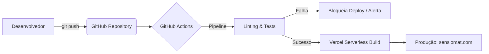

<div align="center">
  <table>
    <tr>
      <td align="center" width="150">
        <!-- Substitua logo.png pelo nome real do seu arquivo -->
        
      </td>
      <td>
        <h1>SensioMat: Motor de Arquitetura IoT e Análise Heurística de Física de Materiais</h1>
        <p><strong>Implantação e Roadmap de Desenvolvimento</strong></p>
      </td>
    </tr>
  </table>
</div>


Este documento fornece as diretrizes para a execução local, a estratégia de implantação contínua (CI/CD) e o roteiro de evolução técnica (*Roadmap*) do SensioMat. O objetivo é orientar desenvolvedores, equipas de DevOps e *stakeholders* sobre o estado atual do projeto e a sua visão de longo prazo na interseção entre a ciência dos materiais, a saúde digital e a agricultura de precisão.

---

## 1. Estratégia de Implantação e CI/CD (Implementado Atualmente)

O repositório utiliza o GitHub Actions para integração contínua e a plataforma **Vercel** para a entrega contínua do monorepo, garantindo que a aplicação esteja sempre otimizada e disponível com latência mínima.

### 1.1. Arquitetura de Deploy

A orquestração do deploy automatiza a verificação de qualidade do código antes de refletir as alterações em ambiente de produção.



### 1.2. Execução Local (Desenvolvimento)

Para clonar e executar a versão atual (MVP) num ambiente de desenvolvimento isolado, siga as instruções abaixo:

**Pré-requisitos:** Node.js (v24+) e NPM/Yarn.

```bash
# 1. Clonar o repositório
git clone [https://github.com/westjoao12/sensiomat-ap3.git](https://github.com/westjoao12/sensiomat-ap3.git)
cd sensiomat-ap3

# 2. Instalar dependências (Monorepo)
# O ambiente pode requerer a instalação separada no frontend e backend no MVP atual
cd frontend && npm install
cd ../backend && npm install

# 3. Configurar Variáveis de Ambiente
# Copie o .env.example para .env nas respetivas pastas
cp frontend/.env.example frontend/.env
cp backend/.env.example backend/.env

# 4. Iniciar os servidores de desenvolvimento
# Terminal 1 (Backend):
cd backend && npm run dev
# Terminal 2 (Frontend):
cd frontend && npm run dev
```

---

## 2. Roadmap: O Futuro do SensioMat

O desenvolvimento do SensioMat está planeado em três fases principais, desenhadas para escalar o sistema de uma ferramenta de validação estática para um ecossistema inteligente e dinâmico.

### Fase 1: Validação Heurística e Interface (🟢 Concluído / MVP Atual)
O foco desta etapa foi provar o conceito central: substituir a testagem laboratorial dispendiosa por avaliações baseadas em software.
*   **[Frontend]** Motor de renderização 3D e interface interativa (*Drag-and-Drop*).
*   **[Backend]** Motor heurístico capaz de processar equações termomecânicas e de dissipação de calor em tempo constante ($O(1)$).
*   **[Sistema]** Suporte nativo à internacionalização (i18n).

### Fase 2: Ecossistema de Big Data em Saúde (🟡 Planejado para Próximas Versões)
Com a base arquitetural consolidada, o objetivo passa a ser o processamento de grandes volumes de dados para otimização da escolha de materiais.
*   **[Banco de Dados]** Implementação de persistência com PostgreSQL, permitindo que utilizadores guardem e partilhem arquiteturas e resultados.
*   **[Serviço de Dados]** Construção de um *pipeline* de **Big Data analytics**, capaz de agregar milhares de simulações anonimizadas.
*   **[Backend / AI]** Módulo de recomendação automatizada. Com base na análise preditiva (Big Data), o SensioMat sugerirá ativamente correções (ex: "Em 85% dos *wearables* simulados para a epiderme, a substituição da Alumina por PDMS reduziu o risco de microlesões").

### Fase 3: IoT Dinâmico e Sincronização em Tempo Real (🔴 Proposta Conceitual)
A visão de longo prazo eleva o SensioMat a uma plataforma de *Digital Twin* (Gémeo Digital), comunicando não só com o *hardware* teórico, mas com dispositivos reais em operação.
*   **[Serviço Científico]** Integração Quântica: Consumo direto de bases de dados acadêmicas (ex: Materials Project) para simulação baseada em Teoria do Funcional da Densidade (DFT).
*   **[Integração IoT]** Criação de uma ponte (via MQTT/WebSockets) onde protótipos físicos reais de biossensores enviam telemetria de volta para a plataforma. O SensioMat compararia, em tempo real, o estresse térmico/mecânico do dispositivo físico no campo contra os limites calculados no seu motor heurístico.
*   **[Aplicações Especializadas]** Criação de sub-módulos dedicados:
    *   *SensioMat Health:* Foco extremo em matrizes poliméricas flexíveis e biocompatibilidade para a próxima geração de *wearables* de monitorização contínua.
    *   *SensioMat Agri:* Foco em corrosão anódica e durabilidade para sensores de subsolo operando em redes de IoT agrícola.